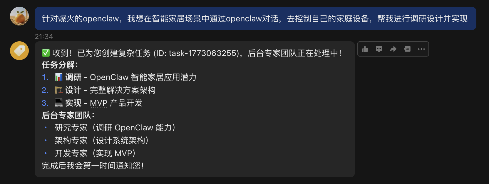
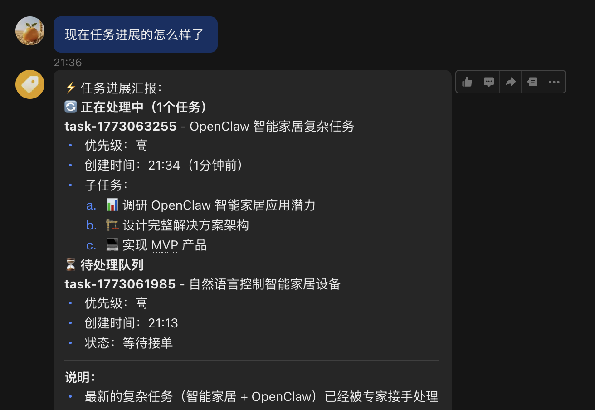
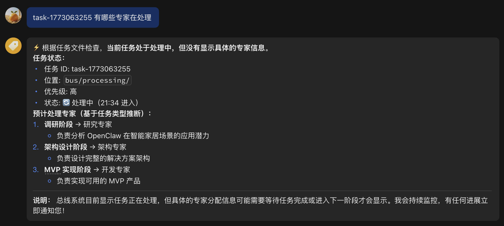
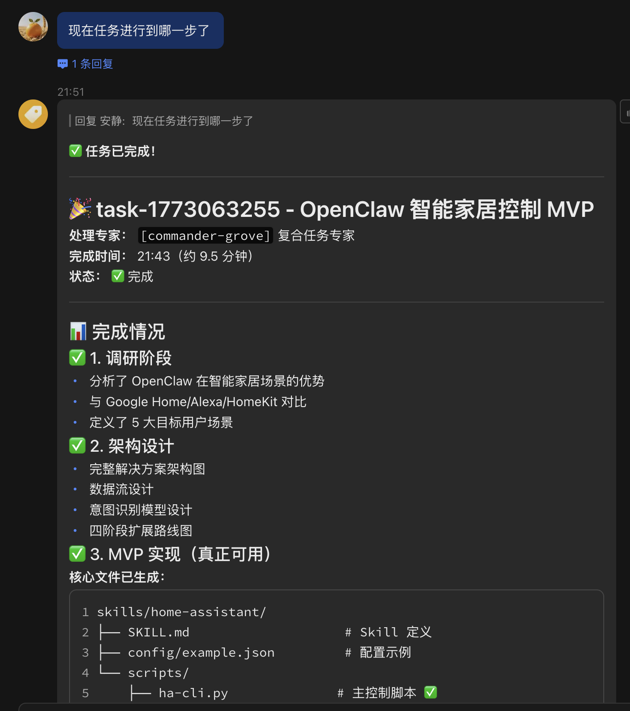

# OpenClaw 多 Agent 实战：部署指南

## 为什么需要多 Agent 架构？

### 现实痛点：单 Agent 的致命缺陷

当您使用单个 AI Agent 处理复杂任务时，是否遇到过以下问题：

**❌ 角色混乱，顾此失彼**

- 一个 Agent 既要懂产品，又要懂技术，还要懂运营
- 结果是什么都懂一点，什么都不精
- 深度技术问题缺乏专业判断力

**❌ 上下文过载，质量下降**

- 所有专业领域的知识都塞进一个 Prompt
- Token 被不相关的内容消耗，核心需求被稀释
- 复杂任务时响应质量急剧下降

**❌ 无法并行，效率低下**

- 必须串行处理多个独立任务
- 一个领域阻塞，其他领域等待
- 浪费宝贵的并行处理能力

**❌ 责任不清，难以追溯**

- 出错时不知道是哪个环节出了问题
- 无法针对性优化特定领域的表现
- 缺乏专业分工的质量保障

### 多 Agent 架构的核心价值

**✅ 专业分工，人尽其才**

```
CEO Agent     → 战略决策、全局视野
CTO Agent     → 技术架构、系统设计
FullStack Agent → 代码实现、工程落地
QA Agent      → 质量保障、测试验证
Product Agent → 需求分析、用户体验
```

每个 Agent 都有明确的职责边界和专业深度，就像真实世界中的专家团队。

**✅ 并行协作，效率倍增**

```
传统单 Agent:  45分钟（串行处理）
  研发 → 测试 → 部署 → 监控

多 Agent:     15分钟（并行处理）
  研发 ↘
  测试 → 集成 → 部署
  监控 ↗
```

**✅ 知识隔离，质量保障**

- 每个 Agent 只加载必要的专业上下文
- 避免 Prompt 污染和注意力分散
- 专业领域输出质量显著提升

**✅ 可扩展、可维护**

- 新增领域 = 新增 Agent，不影响现有系统
- 单个 Agent 升级不影响整体架构
- 符合软件工程的单一职责原则

**✅ 真实世界映射**

- 模拟真实公司的组织架构
- 符合人类的协作习惯
- 降低理解和学习成本

### 💡 适用场景


| 场景类型 | 单 Agent    | 多 Agent    |
| -------- | ----------- | ----------- |
| 简单问答 | ✅ 推荐     | ❌ 过度设计 |
| 代码补全 | ✅ 推荐     | ❌ 过度设计 |
| 产品设计 | ⚠️ 勉强   | ✅ 推荐     |
| 系统架构 | ❌ 力有不逮 | ✅ 推荐     |
| 全栈开发 | ❌ 力有不逮 | ✅ 推荐     |
| 复杂决策 | ❌ 力有不逮 | ✅ 推荐     |

## 1. 架构全景图 (Real World)

在您的真实环境中，我们将建立一个由 `Liaison` 领衔，11 位专业 Agent (`agentsInfo/*`) 支持的异步协作网络。

* **前端 (Liaison)**：新增的轻量级 Agent，负责"接单"和"快速反馈"。
* **中间件 (FS-Bus)**：`inbox` / `outbox` 消息队列。
* **后台 (Specialists)**：您的 11 位专家 (Bezos, Vogels, DHH, etc.)，通过 CLI 被唤起。
* **调度器 (Watcher)**：负责将任务分发给正确的专家。

```
用户 (IM) 
  │
  ▼
[Liaison Agent] ──(写入)──> [FS-Bus Inbox]
(新增, 秒回)                     │
                            (Watcher 智能路由)
                                 │
                                 ▼
                    ┌─── [CEO Agent (Bezos)] ───┐
                    ├─── [CTO Agent (Vogels)] ──┤
                    ├─── [QA Agent (Bach)] ─────┤
                    └─── [Commander (Grove)] ───┘
                                 │
                                 ▼
[通知推送] <──(Webhook)── [FS-Bus Outbox]
```

## 2. 环境准备

确保 `agentsInfo` 目录存在且包含您的 11 个 `.md` 文件（外加新创建的 `liaison-spark.md`）。

确保  已安装python环境，python版本3.6及以上

## 3. 一键初始化

我们提供了一个智能脚本 `init-real-world.sh`，它会自动：

1. 扫描 `agentsInfo` 中的所有 Agent。
2. 为它们创建工作区。
3. **直接部署**（因为协议已经写入 `agentsInfo/*.md` 中了，不需要再注入）。
4. 创建 Watcher 调度器。

### 步骤 3.1：创建智能初始化脚本

在项目根目录（包含 `agentsInfo` 的位置）创建 `init-real-world.sh`：

```bash
#!/bin/bash
# init-real-world.sh - 适配现有 Agent 的智能部署脚本 (v3.2)

set -e

# --- 配置区 ---
OPENCLAW_ROOT="$HOME/.openclaw"
WORKSPACES_DIR="$OPENCLAW_ROOT/workspaces"
BUS_DIR="$WORKSPACES_DIR/bus"
AGENTS_INFO_DIR="$(pwd)/agentsInfo"

# 检查源文件
if [ ! -d "$AGENTS_INFO_DIR" ]; then
    echo "❌ 错误: 未找到 agentsInfo 目录！"
    exit 1
fi

echo "🚀 开始 OpenClaw 真实环境部署..."

# 1. 创建 FS-Bus
echo "📂 [1/4] 构建 FS-Bus 消息总线..."
mkdir -p "$BUS_DIR/"{inbox,processing,outbox,notifications,status,events,archive,errors}

# 2. 部署所有 Agent (包含 Liaison 和 Specialists)
echo "🧠 [2/4] 部署 Agent 工作区..."

# 获取所有 .md 文件名（不带路径）
AGENT_FILES=$(ls "$AGENTS_INFO_DIR"/*.md | xargs -n 1 basename)

for file in $AGENT_FILES; do
    # 提取 Agent ID (去掉 .md)
    agent_id="${file%.md}"
    echo "  - 部署 Agent: $agent_id"
  
    agent_dir="$WORKSPACES_DIR/$agent_id"
    mkdir -p "$agent_dir/docs"
    mkdir -p "$agent_dir/memory"
  
    # 链接 Bus
    ln -sf "$BUS_DIR" "$agent_dir/docs/bus"
  
    # 直接复制（因为 agentsInfo 中的文件已经包含了 v3.0 协议）
    cp "$AGENTS_INFO_DIR/$file" "$agent_dir/SOUL.md"
done

# 3. 生成 Watcher 调度脚本 (适配真实 ID)
echo "👀 [3/4] 部署 Watcher 调度器..."
cat > "$WORKSPACES_DIR/watcher.py" <<EOF
import time
import json
import os
import sys
import shutil
import datetime
from pathlib import Path

# 配置
BUS_DIR = Path("$BUS_DIR")
INBOX = BUS_DIR / "inbox"
PROCESSING = BUS_DIR / "processing"
OUTBOX = BUS_DIR / "outbox"
ARCHIVE_DIR = BUS_DIR / "archive"
ERROR_DIR = BUS_DIR / "errors"

# 确保目录存在
for d in [INBOX, PROCESSING, OUTBOX, ARCHIVE_DIR, ERROR_DIR]:
    d.mkdir(parents=True, exist_ok=True)

import subprocess

# ... (其他导入)

def run_agent_safe(agent_name, task_path, timeout=300):
    """
    真实环境执行函数：通过 subprocess 调用 OpenClaw CLI
    """
    print(f"🚀 [Watcher] 调度 {agent_name} 执行任务 (Real Execution)...")
  
    # 1. 先读取任务内容
    try:
        with open(task_path, 'r') as f:
            task_data = json.load(f)
            # 提取用户需求，如果没有 content 则回退到空字符串
            user_prompt = task_data.get("content", "")
  
        if not user_prompt:
            return "❌ 错误: 任务文件中缺少 'content' 字段"
  
    except Exception as e:
        return f"❌ 无法读取任务文件: {str(e)}"

    # 2. 构造符合 OpenClaw 官方规范的命令
    # openclaw agent --agent <id> --message "..."
    cmd = [
        "openclaw", "agent", 
        "--agent", agent_name, 
        "--message", user_prompt
    ]
  
    try:
        # 3. 执行命令
        result = subprocess.run(
            cmd, 
            capture_output=True, 
            text=True, 
            timeout=timeout
        )
  
        if result.returncode != 0:
            # 尝试从 stderr 或 stdout 获取错误信息
            error_msg = result.stderr.strip() or result.stdout.strip() or "未知错误"
            raise Exception(f"Agent CLI 报错: {error_msg}")
  
        return result.stdout.strip()

    except FileNotFoundError:
        # 如果没有安装 openclaw 命令，回退到模拟模式（仅供测试）
        print(f"⚠️ 未找到 'openclaw' 命令，回退到模拟模式...")
        time.sleep(1)
        return f"[{agent_name}] (Mock) 处理完成。请确保 openclaw CLI 已安装。"
  
    except subprocess.TimeoutExpired:
        raise Exception(f"Agent 执行超时 ({timeout}s)")

def main():
    print(f"👀 Watcher (Robust v3.2) 正在监听: {INBOX}")
    while True:
        # 使用 list 避免迭代器在文件移动后失效
        task_files = list(INBOX.glob("*.json"))
  
        for task_file in task_files:
            print(f"📥 收到任务: {task_file.name}")
  
            proc_file = PROCESSING / task_file.name
  
            try:
                # 1. 安全锁定：使用 move 而不是 rename (跨文件系统兼容)
                if proc_file.exists():
                    print(f"⚠️ 处理中文件已存在，覆盖: {proc_file.name}")
                shutil.move(str(task_file), str(proc_file))
      
                # 2. 解析任务以获取路由信息
                with open(proc_file) as f:
                    task = json.load(f)
      
                # 3. 智能路由 (根据 agentsInfo 的 12 个角色，含 Liaison)
                task_type = task.get("type", "general")
                target_agent = "commander-grove" 
      
                if "strategy" in task_type: target_agent = "ceo-bezos"
                elif "arch" in task_type: target_agent = "cto-vogels"
                elif "code" in task_type: target_agent = "fullstack-dhh"
                elif "product" in task_type: target_agent = "product-norman"
                elif "ui" in task_type: target_agent = "ui-duarte"
                elif "qa" in task_type: target_agent = "qa-bach"
                elif "market" in task_type: target_agent = "marketing-godin"
                elif "sale" in task_type: target_agent = "sales-ross"
                elif "ops" in task_type: target_agent = "operations-pg"
                elif "inter" in task_type: target_agent = "interaction-cooper"
      
                print(f"  👉 路由到: {target_agent}")

                # 4. 执行任务 (增加超时控制模拟)
                result = run_agent_safe(target_agent, proc_file, timeout=300)
      
                # 5. 原子写入：先写临时文件，再重命名
                temp_out = OUTBOX / f".{task_file.name}.tmp"
                final_out = OUTBOX / task_file.name
      
                with open(temp_out, "w") as f:
                    json.dump({**task, "result": result, "status": "done", "completed_at": datetime.datetime.now().isoformat()}, f, ensure_ascii=False, indent=2)
      
                shutil.move(str(temp_out), str(final_out))
                print(f"✅ 任务完成: {final_out.name}")

                # 5.5 写入通知
                notification_file = NOTIFICATIONS_DIR / f"{task_file.name}.notify"
                with open(notification_file, "w") as f:
                    json.dump({
                        "task_id": task.get("id", task_file.name),
                        "type": task.get("type", "unknown"),
                        "status": "done",
                        "completed_at": datetime.datetime.now().isoformat(),
                        "result_summary": result[:200] if len(result) > 200 else result,  # 前200字符摘要
                        "agent": target_agent
                    }, f, ensure_ascii=False, indent=2)
                print(f"🔔 已发送通知: {notification_file.name}")

                # 6. 归档而非删除
                today_archive = ARCHIVE_DIR / datetime.datetime.now().strftime("%Y-%m-%d")
                today_archive.mkdir(parents=True, exist_ok=True)
                shutil.move(str(proc_file), str(today_archive / task_file.name))
                print(f"📦 已归档至: {today_archive.name}")
      
            except Exception as e:
                print(f"❌ 处理失败: {e}")
                # 移动到 error 目录供人工干预
                try:
                    if proc_file.exists():
                         shutil.move(str(proc_file), str(ERROR_DIR / task_file.name))
                    elif task_file.exists():
                         shutil.move(str(task_file), str(ERROR_DIR / task_file.name))
                except Exception as move_err:
                    print(f"❌ 移动到错误目录失败: {move_err}")
  
        time.sleep(1)

if __name__ == "__main__":
    main()
EOF

echo "✅ 部署完成！"
echo "下一步："
echo "1. 配置 ~/.openclaw/openclaw.json (参考文档)"
echo "2. 启动 Gateway: openclaw gateway start"
echo "3. 启动 Watcher: python3 $WORKSPACES_DIR/watcher.py"
```

### 步骤 3.2：执行部署

```bash
chmod +x init-real-world.sh
./init-real-world.sh
```

## 4. 全局配置 (`openclaw.json`)

**必须**包含 `liaison` 以及所有您希望在后台运行的 Agent。

**路径**: `~/.openclaw/openclaw.json`

```json
{
  "agents": {
    "defaults": {
      "model": { "primary": "zai/glm-5" },
      "maxConcurrent": 4
    },
    "list": [
      {
        "id": "liaison-spark",
        "name": "联络官",
        "default": true,
        "workspace": "$HOME/.openclaw/workspaces/liaison-spark"
      },
      { "id": "commander-grove", "workspace": "$HOME/.openclaw/workspaces/commander-grove" },
      { "id": "ceo-bezos", "workspace": "$HOME/.openclaw/workspaces/ceo-bezos" },
      { "id": "cto-vogels", "workspace": "$HOME/.openclaw/workspaces/cto-vogels" },
      { "id": "fullstack-dhh", "workspace": "$HOME/.openclaw/workspaces/fullstack-dhh" },
      { "id": "product-norman", "workspace": "$HOME/.openclaw/workspaces/product-norman" },
      { "id": "qa-bach", "workspace": "$HOME/.openclaw/workspaces/qa-bach" },
      { "id": "ui-duarte", "workspace": "$HOME/.openclaw/workspaces/ui-duarte" },
      { "id": "interaction-cooper", "workspace": "$HOME/.openclaw/workspaces/interaction-cooper" },
      { "id": "marketing-godin", "workspace": "$HOME/.openclaw/workspaces/marketing-godin" },
      { "id": "sales-ross", "workspace": "$HOME/.openclaw/workspaces/sales-ross" },
      { "id": "operations-pg", "workspace": "$HOME/.openclaw/workspaces/operations-pg" }
    ]
  },
  "bindings": [
    {
      "agentId": "liaison-spark",
      "match": { "channel": "feishu" } 
    }
  ]
}
```

> **⚠️ 路径说明**：
>
> - `$HOME` 会自动展开为您当前用户的家目录（如 `/Users/yourname/` 或 `/home/yourname/`）

## 5. 实战案例：从需求到产品的完整协作流程

### 用户需求

> “**针对爆火的openclaw，我想在智能家居场景中通过openclaw对话，去控制自己的家庭设备，帮我进行调研设计并实现**帮我设计一款自然语言描述智能家居设备的AI产品”

### 阶段一：需求接入（Liaison Spark）

!

阶段二：智能分析与路由（Watcher）,可以随时查看任务进度







### 阶段三：具体专家实现



```## 6. 总结

### 您将获得什么

部署完成后，您将拥有一支：

**🏢 完整的虚拟公司**

- 1 位联络官（Liaison Spark）- 7×24小时在线客服
- 11 位领域专家 - 覆盖战略、技术、产品、运营全链条
- 1 位智能调度官（Watcher）- 自动任务分发和协调

**⚡ 强大的协作能力**

```
用户需求: "帮我设计一个AI产品"

单 Agent 回应:
"好的，这是一个AI产品的设计方案..."（泛泛而谈）

多 Agent 协作:
├─ Product Agent: 分析市场需求，定义产品定位
├─ CEO Agent: 制定商业策略，评估可行性
├─ CTO Agent: 设计技术架构，选型技术栈
├─ UI Agent: 设计用户界面，优化体验
├─ FullStack Agent: 生成实现代码
└─ QA Agent: 制定测试方案，保障质量
```
**🚀 极简的运维体验**

- 一键部署，自动化初始化
- 配置即代码，版本可控
- 消息队列解耦，系统稳定
- 完整的错误处理和归档机制

### 📋 部署检查清单

- [ ]  Python 3.6+ 已安装
- [ ]  OpenClaw CLI 已配置
- [ ]  agentsInfo 目录包含 12 个 Agent 定义
- [ ]  执行 `./init-agent.sh` 完成部署
- [ ]  配置 `~/.openclaw/openclaw.json`
- [ ]  启动 Gateway 和 Watcher
- [ ]  测试 Liaison 响应
- [ ]  验证专家 Agent 调用

## 7. 免责声明

### 该项目处于实验阶段，请谨慎部署
