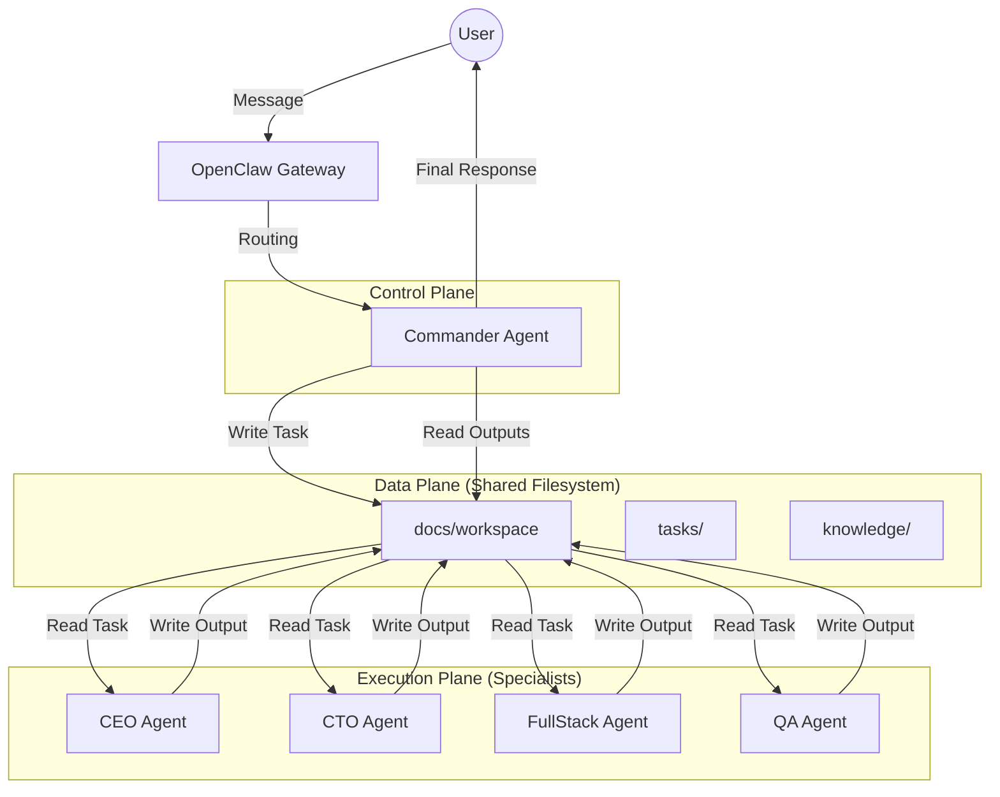
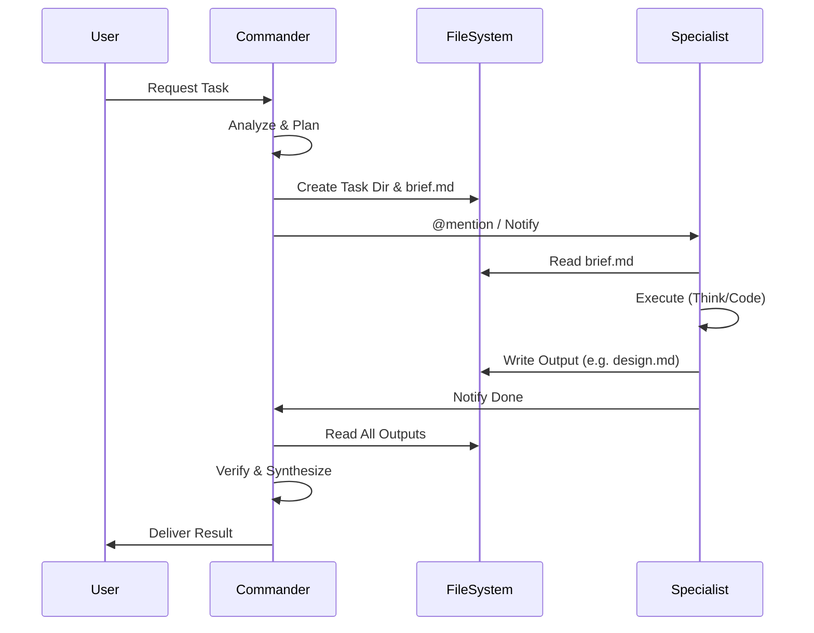

# OpenClaw 多智能体系统架构深度技术分析报告

## 1. 系统架构分析

### 1.1 总体架构设计

本系统基于 OpenClaw 框架，采用 **"Gateway-Hosted Multi-Agent"（单网关多智能体）** 架构，并结合 **"Commander-Specialist"（指挥官-专家）** 的协作模式。

*   **控制平面 (Control Plane)**: 由 OpenClaw Gateway 进程统一管理。它负责接收来自不同渠道（Channel）的消息，并根据路由规则（Bindings）分发给和 Commander 交互。
*   **数据平面 (Data Plane)**: 基于共享文件系统（Shared File System）。所有智能体通过符号链接访问同一个 `docs/workspace` 目录，以此作为数据总线（Data Bus）和上下文共享介质。
*   **执行平面 (Execution Plane)**: 每个智能体（Commander, CEO, CTO 等）作为独立的逻辑单元运行，拥有独立的 `agentDir`（认证、配置）和 `workspace`（运行时文件），但在数据层通过共享目录实现互通。

### 1.2 通信机制

系统采用 **"混合通信模式"**：

1.  **同步消息路由 (User ↔ Commander)**:
    *   **机制**: 基于 OpenClaw 的 `bindings` 配置。
    *   **协议**: 所有外部消息（`channel: "*"`）强制路由至 `commander-grove`。
    *   **特点**: 确保用户只有一个统一的交互入口，屏蔽了多智能体的复杂性。

2.  **异步文档协作 (Commander ↔ Specialists)**:
    *   **机制**: 基于文件读写。
    *   **协议**: "任务文件夹协议"（Task Folder Protocol）。
        *   **指令下发**: Commander 创建 `brief.md`。
        *   **结果反馈**: Specialist 写入特定命名文件（如 `cto-design.md`）。
    *   **特点**: 解耦了智能体的执行，支持长周期任务，且天然持久化。

3.  **通知机制 (Signaling)**:
    *   **机制**: 利用 OpenClaw 的 `@mention` 或子任务调用机制（Sub-agent spawn）。
    *   **现状**: 当前设计主要依赖 Commander 在对话中明确“呼叫”专家（逻辑上的 Handoff），或者由 Commander 代理执行（读取专家输出后反馈给用户）。

## 2. 记忆系统设计调研

### 2.1 记忆分层架构

系统实现了三级记忆管理，以平衡隔离性与协作性：

| 记忆类型 | 存储位置 | 作用域 | 实现机制 | 风险与对策 |
| :--- | :--- | :--- | :--- | :--- |
| **短期记忆** | 内存 / Session Store | **隔离** (Per Session) | OpenClaw 内置 Session 管理，存储当前对话上下文。 | **风险**: 上下文窗口溢出。 **对策**: 定期 Summarization（由模型自动处理）。 |
| **长期记忆** | `workspace/MEMORY.md` | **隔离** (Per Agent) | 智能体根据交互自动更新的 Markdown 文件。 | **风险**: 记忆污染（如果多个 Agent 共享此文件）。 **对策**: **严格隔离**。初始化脚本仅共享 `docs/workspace`，不共享根目录下的 `MEMORY.md`。 |
| **项目记忆** | `docs/workspace/` | **共享** (Global) | 结构化的项目文档、任务记录、知识库。 | **风险**: 文件锁冲突、版本覆盖。 **对策**: **所有权分离**。每个 Agent 只能写自己的特定文件（如 `cto-design.md`），只读他人的文件。 |

### 2.2 记忆一致性评估

*   **Commander vs. Specialist**:
    *   **Commander**: 需要“宽而浅”的记忆。它的 `MEMORY.md` 应记录用户的偏好、项目整体状态和团队能力模型。
    *   **Specialist**: 需要“窄而深”的记忆。例如，CTO 的 `MEMORY.md` 应记录技术栈偏好、架构决策历史。
*   **一致性挑战**: 当 Commander 更新了任务状态（如“任务已完成”），如果 Specialist 的本地 Session 还没更新，可能导致幻觉。
    *   **解决方案**: **SSOT (Single Source of Truth)** 原则。所有关于任务状态的信息，以共享目录下的 `brief.md` 和状态文件为准，Agent 在行动前必须重新读取这些文件。

## 3. 任务分发与处理机制

### 3.1 任务生命周期管理

1.  **创建 (Creation)**:
    *   **触发**: 用户意图识别。
    *   **动作**: Commander 生成唯一 Task ID（`TASK-{YYYYMMDD}-{Name}`），创建目录，写入 `brief.md`。
    *   **元数据**: 包含 `Objective` (目标), `Constraints` (约束), `Dependencies` (依赖), `Deliverables` (交付物)。

2.  **分发 (Dispatch)**:
    *   **机制**: 目前采用 **"Push"** 模式。Commander 在对话流中通过 System Prompt 的指引，明确指示“现在需要 CTO 介入”。
    *   **改进建议**: 引入 **"Event Bus"** 文件。在 `docs/workspace/events.log` 中追加事件，各 Agent 通过 Heartbeat 轮询（OpenClaw 支持 Heartbeat）来实现更解耦的 "Pull" 模式。

3.  **执行 (Execution)**:
    *   **隔离**: Specialist 进入任务目录，读取上下文，进行推理/生成。
    *   **输出**: 严格按照 `SOUL.md` 定义的规范写入文件。

4.  **验收 (Verification)**:
    *   Commander 读取所有输出文件，验证是否满足 `brief.md` 中的验收标准。

## 4. 智能体核心文件实现分析

### 4.1 SOUL.md 结构深度解析

`SOUL.md` 是智能体的“灵魂”，包含三个核心层级：

1.  **Identity Layer (身份层)**:
    *   `Role`: 定义职业身份（如 "CTO"）。
    *   `Persona`: 定义思维模型（如 "Werner Vogels"），影响决策倾向（如 "Everything fails"）。

2.  **Cognitive Layer (认知层)**:
    *   `Core Principles`: 核心原则（如 "API First"），用于在模糊场景下做决策导航。
    *   `Decision Framework`: 具体的思维链（CoT）模板。

3.  **Operational Layer (操作层)**:
    *   **新增**: `任务协作模式` 章节。这是本系统架构的关键扩展。
    *   **定义**: 明确了 Input（读什么文件）和 Output（写什么文件、格式是什么）。
    *   **交互**: 这一层将 `SOUL` 与 `MEMORY` (Shared Workspace) 强绑定。

### 4.2 差异化分析

*   **Commander**: 侧重于 **流程控制** 和 **整合**。其 SOUL 包含大量关于“如何使用其他 Agent”的元知识。
*   **Specialist**: 侧重于 **领域深度**。其 SOUL 包含特定领域的最佳实践和输出模板。

## 5. 系统健壮性与风险评估

### 5.1 潜在风险点

1.  **单点故障 (SPOF)**: Commander 是系统的唯一入口。如果 Commander 的 Prompt 出现逻辑漏洞或死循环，整个系统将瘫痪。
2.  **上下文丢失**: 在多轮对话中，如果 Session token 限制被触发，Agent 可能会忘记当前正在处理的任务 ID。
    *   **缓解**: 强制 Agent 在每次回复前先检查/重述当前 Task ID。
3.  **文件系统竞态**: 虽然概率较低，但如果两个 Agent 同时尝试修改同一个共享文件（如追加日志），可能会导致数据损坏。
    *   **缓解**: 避免共享写。每个 Agent 只写自己的文件。

### 5.2 安全性

*   **权限控制**: OpenClaw 默认 `workspace` 是当前工作目录。通过符号链接共享 `docs/workspace` 是安全的，因为 Agent 仍然被限制在其各自的沙箱内（逻辑上），只能访问链接指向的区域。
*   **指令注入**: 外部用户可能试图通过 Prompt Injection 让 Commander 执行危险的 shell 命令。
    *   **防御**: 在 Commander 的 SOUL 中增加 `System Safeguards`，明确禁止执行高危操作，或启用 OpenClaw 的 `safe` 模式（限制 shell 访问）。

## 6. 改进建议与最佳实践

1.  **引入状态机文件**: 在每个任务目录下维护一个 `status.json`，由 Commander 更新状态（`PENDING`, `IN_PROGRESS`, `REVIEW`, `DONE`），方便程序化监控。
2.  **自动化测试**: 建立一套测试集，模拟用户输入，验证 Commander 是否正确创建了目录结构和文件。
3.  **记忆修剪 (Memory Pruning)**: 定期归档旧任务到 `archive/` 目录，防止 `tasks/` 目录膨胀导致 Agent 读取目录列表时消耗过多 Token。

## 7. 结论

本系统架构巧妙地利用了 OpenClaw 的 **隔离特性**（多 Agent 实例）和 **文件系统能力**（共享工作区），构建了一个低耦合、高内聚的“指挥官+专家”协作网络。

*   **优势**: 结构清晰，易于调试（所有状态都是文件），扩展性强（只需添加新 Agent 定义和目录）。
*   **劣势**: 依赖文件 I/O 可能带来轻微延迟；对 Commander 的上下文理解能力要求极高。
*   **适用场景**: 复杂的软件开发、内容创作、系统设计等需要多角色长流程协作的任务。
